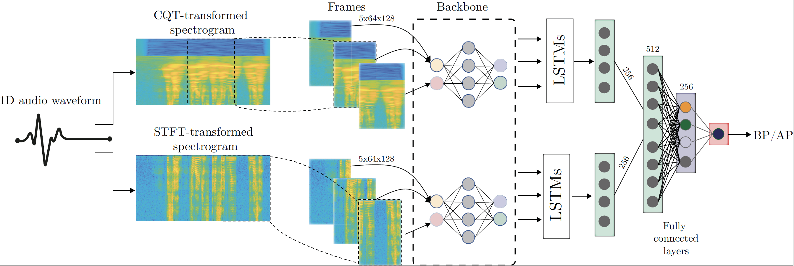

#### This is the official repository of the paper:
### Dual-stream Temporal Convolutional Neural Network for Voice Presentation Attack Detection
### Paper accepted at [IWBF 2022](http://iwbf22.cs.sbg.ac.at/)

 

<hr/>

## Requierements ##

pip install -r requirements.txt

<hr/>


## Citation ##
If you use any of the code provided in this repository or the models provided, please cite the following paper:
```
@inproceedings{GonzalezSoler-DualCNNforVoicePAD-IWBF-2022,
 Author = {L. J. Gonzalez-Soler and M. Gomez-Barrero and M. Kamble and M. Todisco and C. Busch},
 Booktitle = {Proc. Intl. Workshop on Biometrics and Forensics ({IWBF})},
 File = {:https\://dms.dasec.h-da.de/literature/GonzalezSoler-DualCNNforVoicePAD-IWBF-2022.pdf:URL},
 Groups = {ATHENE, RESPECT, CRISP},
 Keywords = {Voice Recognition, Presentation Attack Detection},
 Pages = {1--6},
 Title = {Dual-Stream Temporal Convolutional Neural Network for Voice Presentation Attack Detection},
 Year = {2022}
}
```